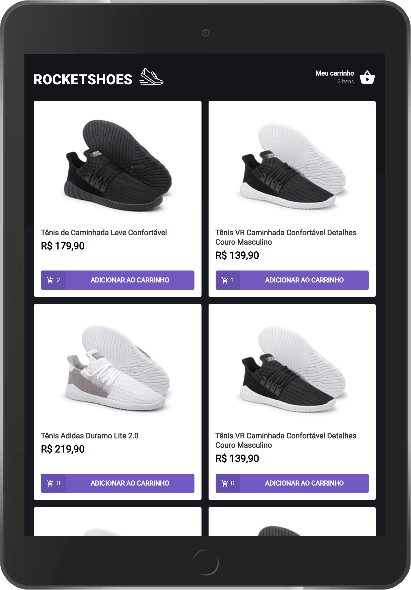
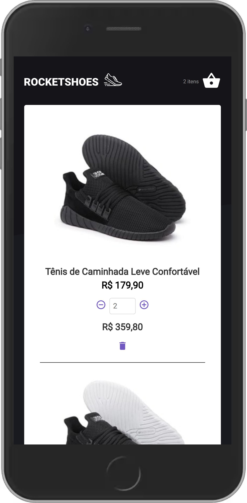
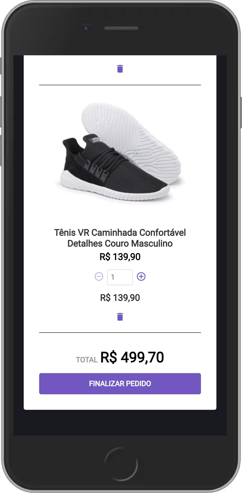

<h1 align="center">
  </img>
</h1>

<p align="center">
  <a href="#ℹ-descrição">Descrição</a> •
  <a href="#-tecnologias">Tecnologias</a> •
  <a href="#-pré-requisitos">Pré-requisitos</a> •
  <a href="#-como-usar">Como usar</a> •
  <a href="#-espiadinha">Espiadinha</a>
</p>

<p align="center">
  </img>
</p>

## ℹ Descrição

Projeto desenvolvido como desafio principal do capítulo 2 do Ignite. 👨‍🚀🚀

O desafio consistia principalmente em adicionar funcionalidades à aplicação, tais como:

- Adicionar um novo produto ao carrinho;
- Remover um produto do carrinho;
- Alterar a quantidade de um produto no carrinho;
- Cálculo dos preços sub-total e total do carrinho;
- Preservar dados do carrinho com localStorage API;
- Validação de estoque;
- Exibição de mensagens de erro;
- Entre outros.

RocketShoes, parecido com um e-commerce, é um SPA que busca dados do servidor (JSON Server) e exibe uma lista de produtos, cada um com seu ID, nome, preço, quantidade no estoque e sua imagem. <br/>É possível adicioná-los ao carrinho, aumentar ou diminuir a quantidade que deseja comprar e removê-los do carrinho. Existe um feedback para cada erro na aplicação através de toasts do react-toastify, como “Quantidade solicitada fora de estoque” ou “Erro na adição do produto”.

## ⚒ Tecnologias

- [**React**](https://pt-br.reactjs.org)
- [**Typescript**](https://www.typescriptlang.org)
- [**styled-components**](https://styled-components.com)
- [**react-toastify**](https://fkhadra.github.io/react-toastify/introduction)
- [**Axios**](https://axios-http.com/)
- [**JSON Server**](https://github.com/typicode/json-server)

## ⚙ Pré-requisitos

- <a href="https://git-scm.com/" target="_blank">Git</a>
- <a href="https://yarnpkg.com/" target="_blank">Yarn</a>
- Editor de código.

## 🖥 Como usar

**Clone o projeto e acesse a pasta**

```bash
$ git clone https://github.com/EduardoReisUX/desafio03-trilha-reactjs.git && cd desafio03-trilha-reactjs
```

**Siga os passos seguintes**

```bash
# Instale as dependências
$ yarn

# Verifique os testes unitários
$ yarn test

# Inicie um servidor do json-server
$ yarn server

# Rode a aplicação
$ yarn start
```

## 👀 Espiadinha

</img>
</img>
</img>
