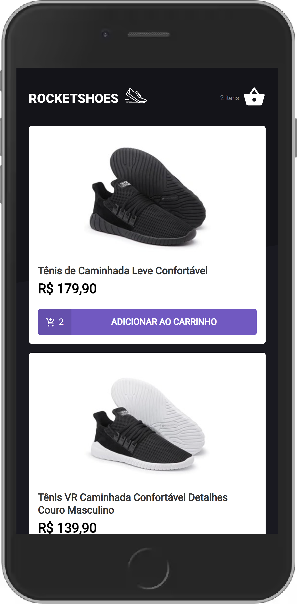

</img>

 

## ℹ Descrição

Projeto desenvolvido como desafio principal do capítulo 2 do Ignite. 👨‍🚀🚀

O desafio consistia principalmente em adicionar funcionalidades à aplicação, tais como:

- Adicionar um novo produto ao carrinho;
- Remover um produto do carrinho;
- Alterar a quantidade de um produto no carrinho;
- Cálculo dos preços sub-total e total do carrinho;
- Preservar dados do carrinho com localStorage API;
- Validação de estoque;
- Exibição de mensagens de erro;
- Entre outros.

RocketShoes, parecido com um e-commerce, é um SPA que busca dados do servidor (JSON Server) e exibe uma lista de produtos, cada um com seu ID, nome, preço, quantidade no estoque e sua imagem.  É possível adicioná-los ao carrinho, aumentar ou diminuir a quantidade que deseja comprar e removê-los do carrinho. Existe um feedback para cada erro na aplicação através de toasts do react-toastify, como “Quantidade solicitada fora de estoque†ou “Erro na adição do produtoâ€.

## ⚒ Tecnologias

- React
- Typescript
- styled-components
- react-toastify
- Axios
- JSON Server

## ⚙ Pré-requisitos

- <a href="https://git-scm.com/" target="_blank">Git</a>
- <a href="https://yarnpkg.com/" target="_blank">Yarn</a>
- Editor de código

## 🖥 Como usar

- `git clone https://github.com/EduardoReisUX/desafio03-trilha-reactjs.git` para clonar este repositório;
- `cd desafio03-trilha-reactjs`
- `yarn install` para instalar as dependências;
- `yarn test` para verificar os testes unitários;
- `yarn server` para subir um server do json-server;
- `yarn start` para desenvolvimento;

## 👀 Espiadinha

</img>
</img>
</img>
